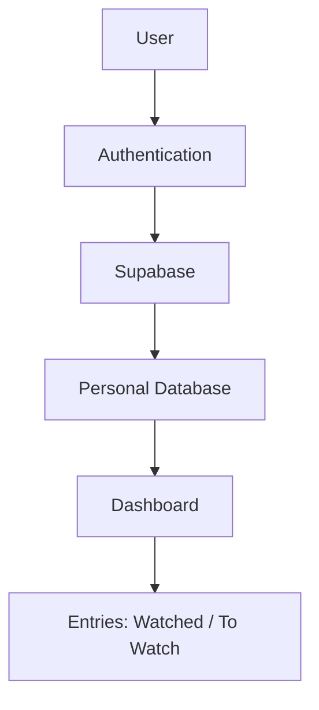

<div align="center">

# After Credits

*For the memories that stayed with you after the credits.*

[](https://srikarchaganti-01.github.io/After-credits/)
[](#license)
[](#tech-stack)
[](https://srikarchaganti-01.github.io/After-credits/)

[Live Demo](https://srikarchaganti-01.github.io/After-credits/) · [Repository](https://github.com/Srikarchaganti-01/After-credits)

</div>

<br>

## About

After Credits is a personal cinema ledger — a private, per-account record of the films and series you've watched or intend to watch. Every user maintains an isolated collection: their own ratings, their own reviews, their own organization.

There is no feed, no public profile, and no shared rating pool. What you save is yours.

> **Note**
> After Credits is not a movie discovery or social rating platform. It is a private archive, built around ownership of your own viewing history rather than public opinion.

## Why After Credits

Public rating platforms optimize for consensus and discovery. After Credits optimizes for none of that — it exists so a personal record of what you watched, when, and how you felt about it doesn't get lost, diluted, or shaped by anyone else's opinion.

| | Public platforms | After Credits |
|---|---|---|
| Ratings | Aggregated, public | Private, personal |
| Reviews | Visible to others | Visible only to you |
| Purpose | Discovery, social | Personal archive |
| Data scope | Shared database | Per-account database |

## Core Features

### Authentication

- Individual user accounts
- Secure login
- Personal dashboard per account

### Cinema Ledger

- Save movies and TV series
- Track watched titles
- Track titles to watch
- Sort and filter the full collection

### Entry Details

Each entry stores:

| Field | Description |
|---|---|
| Title | Movie or series name |
| Director | Credited director |
| Production | Studio or production company |
| Platform | Where it was or can be streamed |
| Rating | Personal rating |
| Review | Personal written review |
| Comments | Freeform notes |
| Links | External references |

## Dashboard Overview

The dashboard surfaces a snapshot of the collection without requiring a full browse:

- 10 most recent entries
- Total number of saved titles
- Collection overview at a glance

## How It Works



Each account authenticates independently and reads and writes only to its own partition of the database. There is no cross-account visibility at any layer.

## Tech Stack

| Layer | Technology |
|---|---|
| Frontend | HTML, CSS, JavaScript |
| Database | Supabase |
| Deployment | GitHub Pages |

## Project Structure

```
After-credits/
├── index.html          # Landing page
├── auth/                # Authentication pages
├── entries/              # Entry creation and detail pages
├── js/                    # Application logic
├── css/                   # Stylesheets
└── assets/                # Images and static assets
```

## Getting Started

### Installation

```bash
git clone https://github.com/Srikarchaganti-01/After-credits.git
cd After-credits
```

### Running Locally

1. Create a Supabase project and obtain your project URL and anon key.
2. Add these credentials to the project's configuration file.
3. Serve the project with any static file server, for example:

   ```bash
   npx serve .
   ```

4. Open the served URL in your browser.

## Project Philosophy

After Credits is deliberately scoped as a single-user-facing tool rather than a platform. Every design decision — private accounts, isolated data, no public ratings — follows from treating a viewing history as personal record-keeping, not content for an audience.

## Future Roadmap

**Version 2**

- Connect to a production backend
- Improve frontend design
- Better responsiveness across devices
- UI refinements
- Improved dashboard

## Contributing

Contributions are welcome. To propose a change:

1. Fork the repository
2. Create a feature branch (`git checkout -b feature/your-feature`)
3. Commit your changes
4. Open a pull request

## License

Distributed under the **MIT License**. See [`LICENSE`](./LICENSE) for details.

## Developer

<div align="center">

**Srikar Chaganti**

[](https://srikarchaganti-01.github.io/portfolio/)
[](https://github.com/Srikarchaganti-01)
[](https://linkedin.com/in/srikar-chaganti-57ba17319)

</div>

---

<div align="center">

<sub>A private ledger for the films that stayed with you.</sub>

</div>
